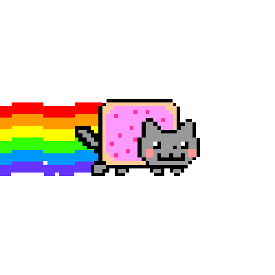
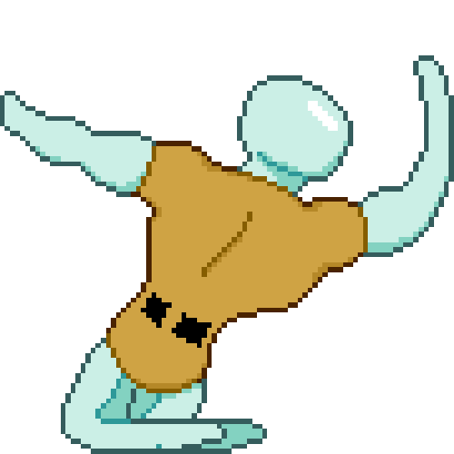

<!-- ESTE ES EL BANNER ANIMADO -->

  

---

<h3 align="center">Sobre mí</h3> 

- 🔭 Actualmente trabajando en varios proyectos, incluyendo plataformas SaaS y aplicaciones web 
- 🌱 Enfocado en el desarrollo full-stack utilizando herramientas modernas y bases de datos robustas. 
- ⚡ Fuera del código: Disfruto de la cultura y estética japonesa, el survival horror clásico y la fotografía botánica.

---

  🛠️ Stack Tecnológico 

**Frontend & Frameworks:**  

**Backend & Bases de Datos:**  

**Infraestructura & Despliegue:**  

**Sistemas Operativos:**  

---

  

<!-- Opcional: Aquí puedes agregar una imagen tuya, un banner con temática Oni/Kitsune o estadísticas de GitHub -->

<h3 align="center">Lo que escucho mientras programo</h3>

&nbsp; **[Escuchala](https://open.spotify.com/intl-es/artist/4zbbvLJ40NWPcYoqKKc3fK?si=tPliiEBnRQ6UovbNjHUwfg)**  
 

---

<h3>Mis redes</h3>

&nbsp;&nbsp;&nbsp;&nbsp;&nbsp;&nbsp; 

